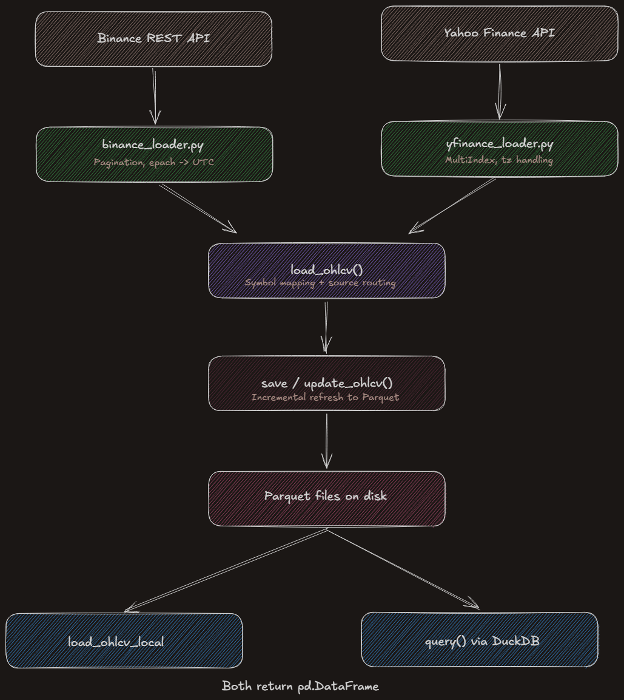
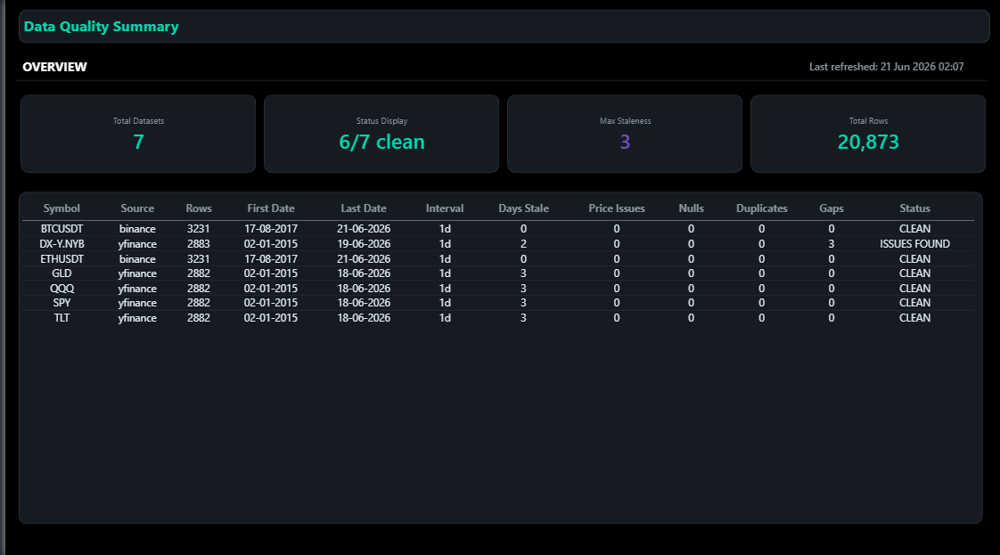

## quant-data-engine

Financial data engine that pulls, cleans, stores, and serves market data as a queryable local database.

**Status:** Core pipeline operational — loaders, storage, incremental updates, SQL queries.  
**In progress:** Data quality layer, WebSocket trade collector, order book snapshots.

### Architecture



### What it does

- Loads OHLCV data from Binance (REST API) and Yahoo Finance, with unified symbol mapping across sources.
- Cleans and standardizes every DataFrame: lowercase columns, UTC-aware index, canonical OHLCV order — regardless of source.
- Stores data locally as Parquet files with incremental updates — fetch once, refresh daily, never re-download history.
- Queries stored data instantly via DuckDB SQL or direct DataFrame load — no API calls, no internet required.

### Quickstart

```bash
git clone https://github.com/s02minu/quant-data-engine.git
cd quant-data-engine
python -m venv .venv
.venv\Scripts\activate
pip install -r requirements.txt
pip install -e .
```

### Usage

**Fetch and store data**
```python
from qde.storage import save_ohlcv

save_ohlcv("BTCUSDT", source="binance", start="2015-01-01")
save_ohlcv("SPY", source="yfinance", start="2015-01-01")
```

**Load stored data (no API call, instant)**
```python
from qde.storage import load_ohlcv_local

df = load_ohlcv_local("BTCUSDT", source="binance")
```

**Query with SQL via DuckDB**
```python
from qde.storage import query

df = query("SELECT date, close FROM BTCUSDT_binance_1d WHERE close > 60000")
```

**Update with only new data**
```python
from qde.storage import update_ohlcv

update_ohlcv("BTCUSDT", source="binance")
```

### Project structure
```
src/qde/
├── __init__.py              # Package root
├── storage.py               # Save, load, update Parquet + DuckDB query
└── loaders/
    ├── __init__.py           # Unified load_ohlcv() with source routing
    ├── binance_loader.py     # Binance REST API, pagination, epoch → UTC
    ├── yfinance_loader.py    # Yahoo Finance loader, MultiIndex handling
    └── symbols.py            # Cross-source symbol mapping

```

### Tech stack 
| Tool | Role |
|------|------|
| pandas | Data manipulation and DataFrame standard |
| requests | Direct HTTP calls to Binance REST API |
| yfinance | Yahoo Finance convenience wrapper |
| pyarrow | Parquet read/write engine |
| DuckDB | SQL queries directly on Parquet files |
| pytest | Automated testing |

### Tests
```bash
pytest
```
13 tests covering loader contracts, symbol mapping, storage round-trips, and error handling.


### Data quality monitoring

Automated daily quality checks with Power BI dashboard connected to pipeline output.




### Roadmap
- **WebSocket trade collector** — live tick-level trade streaming from Binance.
- **Order book snapshots** — periodic depth snapshots for microstructure analysis.

### Limitations
- Tests require internet access (API responses are not mocked).
- No retry logic on rate-limited requests.
- Single-user local storage only — no concurrent access.
- Symbol mapping is manual — new symbols must be added to symbols.py.

### License
MIT