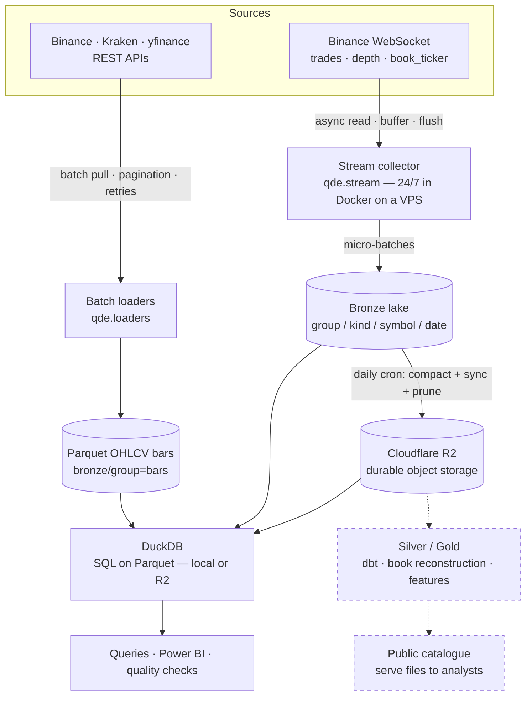
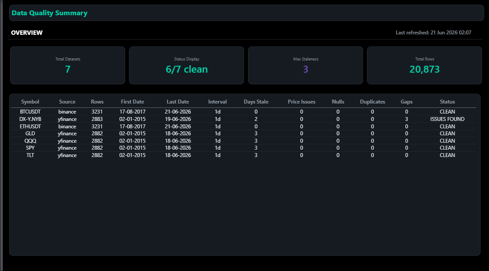

## quant-data-engine

Financial data platform that ingests, stores, and serves market data — batch OHLCV and live crypto microstructure — as a queryable Parquet lakehouse on Cloudflare R2.

**Status:** Running in production — autonomous ingestion, cloud storage, and direct querying.  
**Batch:** REST loaders, Parquet storage, incremental updates, DuckDB SQL, Power BI quality monitoring.  
**Streaming:** live trades, L2 order-book deltas, and top-of-book quotes captured to a partitioned bronze lake — micro-batching, reconnection, gap detection; runs **24/7 in Docker on a VPS**.  
**Storage & serving:** a daily job compacts and syncs bronze to **Cloudflare R2** (zero-egress object storage) and prunes locally; the lake is queried directly with DuckDB, no server. Linted (ruff), type-checked (mypy), and tested offline (pytest).

### Architecture


```mermaid
flowchart TD
    subgraph SRC["Sources"]
      REST["Binance · Kraken · yfinance<br/>REST APIs"]
      WS["Binance WebSocket<br/>trades · depth · book_ticker"]
    end

    REST -->|"batch pull · pagination · retries"| BL["Batch loaders<br/>qde.loaders"]
    WS -->|"async read · buffer · flush"| SC["Stream collector<br/>qde.stream — 24/7 in Docker on a VPS"]

    BL --> BARS[("Parquet OHLCV bars<br/>bronze/group=bars")]
    SC -->|"micro-batches"| BRONZE[("Bronze lake<br/>group / kind / symbol / date")]

    BRONZE -->|"daily cron: compact + sync + prune"| R2[("Cloudflare R2<br/>durable object storage")]

    BARS --> DUCK["DuckDB<br/>SQL on Parquet — local or R2"]
    BRONZE --> DUCK
    R2 --> DUCK
    DUCK --> OUT["Queries · Power BI · quality checks"]

    R2 -.-> SILVER["Silver / Gold<br/>dbt · book reconstruction · features"]
    SILVER -.-> PUB["Public catalogue<br/>serve files to analysts"]

    classDef planned stroke-dasharray:5 5;
    class SILVER,PUB planned;
```

Solid = operational today (ingestion → bronze → R2 → query, running autonomously). Dashed = planned phases (full plan and reasoning in [docs/ROADMAP.md](docs/ROADMAP.md)).

### What it does

- Loads OHLCV data from Binance (REST API), Yahoo Finance, and Kraken (REST API), with unified symbol mapping across sources.
- Cleans and standardizes every DataFrame: lowercase columns, UTC-aware index, canonical OHLCV order — regardless of source.
- Stores data locally as Parquet files with incremental updates — fetch once, refresh daily, never re-download history.
- Queries stored data instantly via DuckDB SQL or direct DataFrame load — no API calls, no internet required.
- Monitors data quality automatically with four checks (gaps, duplicates, nulls, price sanity), surfaced in a Power BI dashboard.
- Captures live Binance microstructure — trades, order-book deltas, and top-of-book quotes — over WebSockets into a hive-partitioned bronze lake, buffering and flushing micro-batches, reconnecting on drops, and recording gaps so a hole in the tape is never silent.
- Runs autonomously: the collector runs 24/7 in Docker on a VPS, and a daily cron job compacts each settled day's small files, syncs them to Cloudflare R2, and prunes local copies — so the disk stays flat and the box is disposable.
- Serves files, not queries: query the R2 lake directly with your own DuckDB (partition pruning, column pushdown), pushing compute to the client so marginal cost per user is near zero — R2's zero egress fees make this viable.

### Quickstart

```bash
git clone https://github.com/s02minu/quant-data-engine.git
cd quant-data-engine
python -m venv .venv
.venv\Scripts\activate
pip install -e .
```
To run the tests, install with the dev extras instead: `pip install -e ".[dev]"`

This local install covers development, the batch loaders, the tests, and ad-hoc
collector runs. To run the collector continuously, use Docker instead — see
[Streaming collector](#streaming-collector-microstructure) below.

### Usage

**Fetch and store data**
```python
from qde.storage import save_ohlcv

save_ohlcv("BTCUSDT", source="binance", start="2015-01-01")
save_ohlcv("SPY", source="yfinance", start="2015-01-01")
```

**Query stored data with SQL**
```python
from qde.storage import query

df = query("SELECT date, close FROM bars WHERE symbol='BTCUSDT' AND close > 60000")
```

**Update with only new data**
```python
from qde.storage import update_ohlcv

update_ohlcv("BTCUSDT", source="binance")
```

**Backfill a date range — idempotent, works identically across sources**
```bash
python -m qde.backfill --source binance --symbol BTCUSDT --from 2015-01-01
```

### Streaming collector (microstructure)

Captures live Binance data — trades, L2 order-book deltas, and top-of-book quotes —
into a hive-partitioned bronze Parquet lake. It buffers in memory and flushes
micro-batches on a fixed interval, reconnects with exponential backoff, and records
sequence gaps and session boundaries so downtime is always visible rather than silent.
Unlike the batch OHLCV data, streamed microstructure is un-backfillable — the design
prioritizes never losing what can never be re-fetched.

Run locally (Ctrl-C flushes buffered rows before exit):
```bash
python -m qde.stream
```

Configure via environment variables:
```bash
QDE_SYMBOLS=BTCUSDT,ETHUSDT QDE_KINDS=trades,depth,book_ticker python -m qde.stream
```

Run continuously in Docker — auto-restart on crash, graceful shutdown on stop,
data persisted to the host `./data`:
```bash
docker compose up --build -d
```

Captured data lands under a partitioned bronze layout:
```
data/bronze/group=microstructure/source=binance/kind=<kind>/symbol=<symbol>/date=<date>/part-*.parquet
```
Query it directly with DuckDB, reading partition keys as columns:
```python
import duckdb

duckdb.sql(
    "SELECT kind, symbol, count(*) FROM read_parquet('data/bronze/**/*.parquet', hive_partitioning=true) GROUP BY ALL"
)
```

### Cloud storage & serving

A daily maintenance job (`scripts/maintain.sh`, run by cron on the VPS) refreshes
the batch bars incrementally (`qde.daily_update`), compacts each settled day's many
small microstructure part files into a few large ones, then syncs to Cloudflare R2.
Microstructure is uploaded and **pruned locally only after R2 confirms a same-size
copy** (so the disk stays flat and the box is disposable); the mutable bars files are
mirrored to R2 with overwrite and kept locally for the next incremental update.
Compaction (`qde.compact`, which streams part files through Arrow one at a time so it
never loads a whole partition into memory) and sync (`qde.sync`) are crash-safe and
idempotent.

R2's zero egress fees make the serving model viable: instead of hosting a query
engine, the lake is published as files and analysts point their own DuckDB at it,
pushing compute to the client.

```python
from qde.lake import query  # same SQL as qde.storage.query, but reading from R2

# `bars` and each microstructure kind (`trades`, `depth`, ...) are pre-registered
# as views, so a query reads like a database rather than a read_parquet('r2://...') call.
query("SELECT date, close FROM bars WHERE symbol = 'BTCUSDT'")
query("SELECT symbol, count(*) AS trades FROM trades GROUP BY symbol")
```

For full control over which partitions are scanned, build the glob yourself with
`open_lake()` + `bronze_glob()` (microstructure) or `bars_glob()` (bars).

### Project structure
```
src/qde/
├── __init__.py               # Package root
├── storage.py                # Save, load, update Parquet + DuckDB query
├── quality.py                # Data quality checks + summary
├── compact.py                # Stream-merge small bronze part files (memory-safe)
├── sync.py                   # Sync microstructure to R2 (prune) + publish bars
├── lake.py                   # Query the R2 lake with DuckDB (read-only token)
├── daily_update.py           # Nightly incremental refresh of all bar series
├── backfill.py               # Idempotent group-level backfill CLI
├── loaders/                  # Batch REST ingestion (OHLCV bars)
│   ├── __init__.py           # Unified load_ohlcv() with source routing
│   ├── exceptions.py         # NoNewData — a successful but empty response
│   ├── http.py               # Retry helper with exponential backoff
│   ├── binance_loader.py     # Binance REST API, pagination, epoch → UTC
│   ├── yfinance_loader.py    # Yahoo Finance loader, MultiIndex handling
│   ├── kraken_loader.py      # Kraken REST API, cursor pagination
│   └── symbols.py            # Cross-source symbol mapping
└── stream/                   # WebSocket capture → bronze (microstructure)
    ├── config.py             # StreamConfig: symbols, kinds, flush window
    ├── collector.py          # Async connect, buffer, flush, reconnect
    ├── parsers.py            # Raw payload → flat bronze row
    ├── gaps.py               # Sequence-gap and session-boundary tracking
    ├── paths.py              # Hive-partitioned bronze path builder
    └── __main__.py           # `python -m qde.stream` entry point

scripts/maintain.sh                # Daily compact + sync (run by cron on the VPS)
Dockerfile, docker-compose.yml     # Containerized 24/7 collector
```

### Tech stack
| Tool | Role |
|------|------|
| pandas | Data manipulation and DataFrame standard |
| requests | Direct HTTP calls to Binance and Kraken REST APIs |
| yfinance | Yahoo Finance convenience wrapper |
| websockets | Async client for Binance live streams |
| asyncio | Concurrency for the streaming collector (read loop + flush + snapshot) |
| pyarrow | Parquet read/write engine |
| DuckDB | SQL queries directly on Parquet files, local or on R2 (`httpfs`) |
| Cloudflare R2 (boto3) | Durable, zero-egress object storage for the lake |
| pandas-market-calendars | NYSE calendar for equity gap detection |
| pytest | Automated testing (incl. mocked socket + S3) |
| ruff, mypy | Linting, formatting, and static type checking |
| Docker + cron | 24/7 collector (restart policy) + daily compact/sync/prune |

### Tests
```bash
pytest
```
Covering loader contracts, symbol mapping, and storage round-trips on the batch side;
and config, paths, parsers, gap detection, compaction (including crash-recovery),
R2 sync, and lake-query construction on the streaming/cloud side. The socket and the
S3 client are both faked, so these suites run **offline and deterministically** —
including the disconnect-and-recover path that can't be triggered against the live
exchange, and the upload-verify-prune path without touching real R2.

### Data quality monitoring

Automated daily quality checks with a Power BI dashboard connected to pipeline output.




### Roadmap

This project evolves deliberately — every tool must solve a real problem
before it's added. Full plan with phases and reasoning: [docs/ROADMAP.md](docs/ROADMAP.md)

**Done:** local Parquet lakehouse → Cloudflare R2 object storage with daily
compaction + sync → direct DuckDB querying of the remote lake, deployed and
running autonomously.

**Next:** dbt transformations (silver/gold, order-book reconstruction) →
Dagster orchestration → public catalogue + Streamlit dashboard.

**Deliberately deferred at current scale:** Spark (data fits on one machine —
DuckDB is faster here), Kafka (one producer, one consumer, replayable sources),
Kubernetes (a single container doesn't need an orchestrator). These get
revisited when the constraints that justify them actually appear.

### Limitations
- Batch loader tests hit live APIs (not yet mocked); streaming and lake tests run offline.
- The R2 lake is currently private (querying needs a read-only token); the public open lake and catalogue service are still planned.
- Symbol mapping is manual — new symbols must be added to symbols.py.
- Kraken's public OHLC endpoint serves only ~720 recent candles per interval, regardless of start date — deep history requires its paid data service.
- Order-book reconstruction from depth deltas is deferred to a later transform; the collector captures raw deltas and periodic snapshots (bronze), not a rebuilt book.
- Latency (`received_at − event_time`) is subject to clock skew between machines; treat absolute values as approximate.

### License
MIT