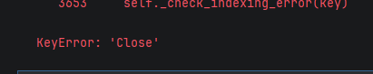
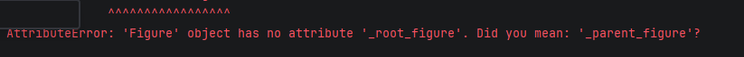
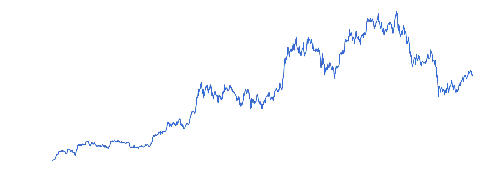

# My Learning Journey

## Introduction

Don't really know where to begin with this. Maybe a brief where I currently find myself is a good intro to what this 
is about.

I'm currently a data analyst intern who is trying desperately to land a finance job in a data related world. 
I recently developed an eagerness for quantitative finance, so going back to uni seemed the obvious choice, but I need
to be working while going after this goal. I'm a big fan of not starving to death or living in the streets,
and working in a transitionable field seems to be the smartest choice (not that I'm that smart though).

If I'm being completely honest here the main reason why quant became a goal of mine is because I want to be RAF, and God 
knows I've tried multiple things in other to be so. Of all I tired though, day trading seemed to be the one I actually 
saw a glimpse of hope, more espefically Orderflow trading. But if you are as impulsive as I am, implementing the 
strategies you learn can prove to be challenging. Plus the recent skills I acquired during my level 5 
(I live in Portugal) Data Science and Information Management course meant I could actually find a way to automate 
OF concepts without having to actually see the charts.

So I came up with the idea of creating portfolio worthy predictive models, which I can of did successfully, or so I 
thought. I had relied heavily on AI for the coding, modeling or debugging, so no not only did I not really 
retain any knowledge, but I also felt like a fraud. Hence, this project.

Don't get me wrong, I'm still using AI for this, I mean, it's kind of ridiculous to have a tool and not use it, but 
this time I'm using the tool more for a mentorship than a coding slave. 

So here is the new approach:
1. My AI mentor first gave me a Quant Research Ecosystem roadmap, with a total of 8 projects.
2. Then for every project I have mentor that divides the project into sessions.
3. I am directed to books and documentations for the coding, debugging and concepts.
4. After every session I explain in my own words what I've learnt
5. Because I love validation seeking I post my findings and learning on platforms.

So hopefully by the end of each project I have a complete mental image of what the actual "f" I built.


## Lesson One - Notebooks vs Modules

So one of the first thing I did differently in this project is using a notebook in addition to the .py 
modular files. Running the code first in a notebook gives you a better mental view if what each block of code 
produces before moving to the next block of code.

For this session I encountered 2 bugs:
1. A KeyError: 'Close' 
2. AttributeError: 'Figure' object has no attribute '_root_figure'. 
Did you mean: '_parent_figure'?

Part of my assignments for this session was to get BTC-USD's highest closing price and the date it occurred:
```
highest_close = df['Close'].max()
date_of_highest_close = df['Close'].idxmax()

print(highest_close)
print(date_of_highest_close)

```

It seemed a relatively simple task, or so I thought. But apparently, yfinance use MultiIndex columns which essentially 
meant multiple tickers could be held in one frame, so the columns, were doubled labeled: one label for the ticker and
the other for the OHLCV label, looking something like "('BTC-USD', 'Close')".

To fix this, I simply renamed all the columns.
```
df.columns = ['Open', 'High', 'Low', 'Close', 'Volume']
```

Resulting in "(['Open', 'High', 'Low', 'Close', 'Volume'])", and consequently overcoming the initial error.

The second bug was simply a typo. Rather than `figure(figsize)` I typed `figure(figure)`. 

Hers is the plotted chart after the debugging:



